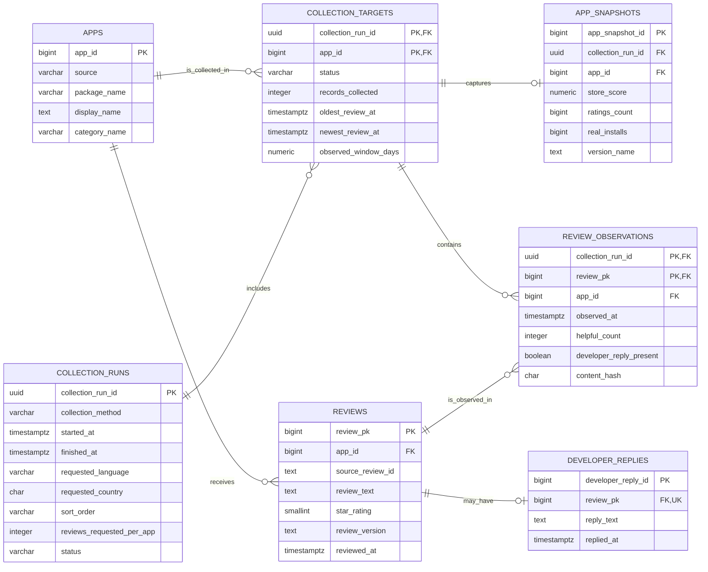

# Google Play Review Database Schema Proposal

Status: proposed baseline for implementation review

Prepared: 2026-10-05

Target database: PostgreSQL 15+

## 1. Purpose and scope

This schema turns the Google Play EDA findings into a small, implementation-ready
relational model. It supports:

- multiple apps and repeated collection runs;
- deduplication by the Google Play review identifier;
- per-run sampling settings and per-app time coverage;
- time-stamped app-store metadata snapshots;
- optional developer replies; and
- traceability from a review back to every run in which it was observed.

It deliberately does not model reviewers, profile images, sentiment, themes, or
downstream aggregates. Reviewer names and images were excluded from collection,
and derived analytics can be added later without changing the ingestion model.
The source used in the EDA is the unofficial `google-play-scraper` package, not
an official Google API; production use still requires the governance review
described in the source assessment.

## 2. Design summary

The baseline contains seven tables:

| Table | Purpose |
|---|---|
| `apps` | One stable row per Google Play package. |
| `collection_runs` | One row per execution, including request settings and run status. |
| `collection_targets` | One app's outcome within a run, including the observed review window. |
| `app_snapshots` | Changeable Google Play app metadata captured during a run. |
| `reviews` | The latest stored state of each source review, unique within an app. |
| `review_observations` | Junction between runs and reviews, with fields that can change between observations. |
| `developer_replies` | The latest stored developer reply for a review, when one has been observed. |

`collection_targets` and `review_observations` are operational records rather
than independent business entities. Although this produces seven physical
tables, it keeps the four main concepts identified by the EDA—app, run, review,
and developer reply—separate while preserving repeat-collection provenance.

The executable PostgreSQL DDL is in
[`google_play_schema.sql`](google_play_schema.sql).

## 3. Entity-relationship diagram

The diagram is intentionally limited to key fields. The data dictionary in the
next section is authoritative for the full column definitions.

## 4. Data dictionary

### 4.1 `apps`

Stable identity and analyst-assigned classification for an app. Store listing
attributes that can change over time belong in `app_snapshots`.

| Column | PostgreSQL type | Null? | Key / rule | Meaning |
|---|---|---:|---|---|
| `app_id` | `bigint` identity | No | PK | Internal app identifier. |
| `source` | `varchar(50)` | No | UQ with `package_name` | Source namespace; baseline value is `google_play`. |
| `package_name` | `varchar(255)` | No | UQ with `source` | Stable Android package identifier. |
| `display_name` | `text` | No |  | Working display name used by the project. |
| `category_name` | `varchar(100)` | Yes |  | Project sampling category; it can differ from the live store genre. |
| `created_at` | `timestamptz` | No | default `now()` | Row creation time. |

### 4.2 `collection_runs`

One execution of the collector. Request parameters describe the request, not
the reviewer's actual language or country.

| Column | PostgreSQL type | Null? | Key / rule | Meaning |
|---|---|---:|---|---|
| `collection_run_id` | `uuid` | No | PK | Generated run identifier. |
| `source` | `varchar(50)` | No |  | Baseline value `google_play`. |
| `collection_method` | `varchar(100)` | No |  | For example `third_party_open_source_scraper`. |
| `collector_name` | `varchar(100)` | No |  | For example `google-play-scraper`. |
| `collector_version` | `varchar(50)` | Yes |  | Dependency or collector version. |
| `official_api` | `boolean` | No |  | `false` for the EDA workflow. |
| `started_at` | `timestamptz` | No |  | UTC start time. |
| `finished_at` | `timestamptz` | Yes | must be after start | UTC finish time. |
| `requested_language` | `varchar(10)` | No |  | Request parameter such as `en`. |
| `requested_country` | `char(2)` | No |  | Storefront parameter such as `US`. |
| `sort_order` | `varchar(30)` | No |  | For example `newest`. |
| `reviews_requested_per_app` | `integer` | No | positive | Requested cap for each app. |
| `target_app_count` | `integer` | No | nonnegative | Number of intended app targets. |
| `delay_seconds` | `numeric(8,3)` | Yes | nonnegative | Configured delay between targets. |
| `status` | `varchar(20)` | No | enum check | `running`, `completed`, `partial`, or `failed`. |
| `error_message` | `text` | Yes |  | Run-level failure detail, if applicable. |
| `created_at` | `timestamptz` | No | default `now()` | Database insertion time. |

### 4.3 `collection_targets`

The result of collecting one app in one run. This table makes the fixed-count
sampling issue explicit: `records_collected` must be interpreted together with
`oldest_review_at`, `newest_review_at`, and `observed_window_days`.

| Column | PostgreSQL type | Null? | Key / rule | Meaning |
|---|---|---:|---|---|
| `collection_run_id` | `uuid` | No | PK, FK → `collection_runs` | Parent run. |
| `app_id` | `bigint` | No | PK, FK → `apps` | Target app. |
| `status` | `varchar(30)` | No | enum check | `success`, `no_records_returned`, or `failed`. |
| `records_collected` | `integer` | No | nonnegative | Rows returned, including repeats from earlier runs. |
| `unique_review_ids` | `integer` | No | nonnegative | Unique source review IDs returned for this target. |
| `continuation_available` | `boolean` | Yes |  | Whether another page/token was available. |
| `elapsed_seconds` | `numeric(12,3)` | Yes | nonnegative | Collection time for this app. |
| `oldest_review_at` | `timestamptz` | Yes |  | Oldest review timestamp observed in this target sample. |
| `newest_review_at` | `timestamptz` | Yes |  | Newest review timestamp observed in this target sample. |
| `observed_window_days` | `numeric(12,4)` | Yes | derived/check | `(newest - oldest)` expressed in days. |
| `error_type` | `varchar(100)` | Yes |  | Exception class for a failed target. |
| `error_message` | `text` | Yes |  | Target-level failure detail. |

The composite PK allows one result per app per run. It also becomes the parent
key for `review_observations`, preventing an observation from being attached to
an app that was not a target in that run.

### 4.4 `app_snapshots`

Time-varying app listing metadata. A run can capture at most one snapshot for
each target app.

| Column | PostgreSQL type | Null? | Key / rule | Meaning |
|---|---|---:|---|---|
| `app_snapshot_id` | `bigint` identity | No | PK | Internal snapshot identifier. |
| `collection_run_id` | `uuid` | No | FK with `app_id` → `collection_targets` | Run that captured the listing. |
| `app_id` | `bigint` | No | FK with run; UQ with run | Snapshotted app. |
| `captured_at` | `timestamptz` | No |  | Snapshot timestamp. |
| `store_title` | `text` | Yes |  | Current listing title. |
| `store_genre` | `varchar(100)` | Yes |  | Human-readable Google Play genre. |
| `store_genre_id` | `varchar(100)` | Yes |  | Machine-readable genre ID. |
| `store_score` | `numeric(8,6)` | Yes | 0–5 | Aggregate store score. |
| `ratings_count` | `bigint` | Yes | nonnegative | Store rating count. |
| `reviews_count` | `bigint` | Yes | nonnegative | Store review count. |
| `installs_label` | `varchar(50)` | Yes |  | Display value such as `500,000,000+`. |
| `minimum_installs` | `bigint` | Yes | nonnegative | Parsed lower-bound installs. |
| `real_installs` | `bigint` | Yes | nonnegative | Estimated/returned install count. |
| `price_amount` | `numeric(12,2)` | Yes | nonnegative | Listed price. |
| `is_free` | `boolean` | Yes |  | Whether the app is free. |
| `currency_code` | `char(3)` | Yes | uppercase | ISO-style currency code such as `USD`. |
| `developer_name` | `text` | Yes |  | Listing developer name. |
| `released_on` | `date` | Yes |  | Parsed initial release date. |
| `store_updated_at` | `timestamptz` | Yes |  | App update time converted from the raw epoch. |
| `version_name` | `text` | Yes |  | Current listing version text. |
| `content_rating` | `varchar(100)` | Yes |  | Store content rating. |
| `ad_supported` | `boolean` | Yes |  | Raw `adSupported` flag. |
| `contains_ads` | `boolean` | Yes |  | Raw `containsAds` flag; retained separately because the source exposes both. |
| `offers_iap` | `boolean` | Yes |  | Whether in-app purchases are offered. |

### 4.5 `reviews`

One row per Google Play review identity, holding its latest stored content and
rating. The surrogate PK keeps foreign keys small; `UNIQUE (app_id,
source_review_id)` enforces the EDA's natural uniqueness boundary because
`apps` is itself unique on `(source, package_name)`.

| Column | PostgreSQL type | Null? | Key / rule | Meaning |
|---|---|---:|---|---|
| `review_pk` | `bigint` identity | No | PK | Internal review identifier. |
| `app_id` | `bigint` | No | FK → `apps`; UQ with source ID | Reviewed app. |
| `source_review_id` | `text` | No | UQ with `app_id` | Google Play `reviewId`. |
| `review_text` | `text` | No |  | Latest retained review text. Access should be restricted. |
| `star_rating` | `smallint` | No | check 1–5 | Latest rating. |
| `review_version` | `text` | Yes |  | App version associated with the review. |
| `reviewed_at` | `timestamptz` | No |  | Google Play review timestamp. |
| `first_seen_at` | `timestamptz` | No |  | First ingestion time. |
| `last_seen_at` | `timestamptz` | No |  | Most recent ingestion time. |
| `updated_at` | `timestamptz` | No | default `now()` | Last database update time. |

### 4.6 `review_observations`

A review can appear in multiple runs, and a run contains many reviews. This
junction preserves that many-to-many relationship and the fields that commonly
change without duplicating the full review text on every run.

| Column | PostgreSQL type | Null? | Key / rule | Meaning |
|---|---|---:|---|---|
| `collection_run_id` | `uuid` | No | PK, composite FK | Observation run. |
| `review_pk` | `bigint` | No | PK, FK → `reviews` | Observed review. |
| `app_id` | `bigint` | No | composite FK → target | Denormalized only to enforce the run/app target relationship. |
| `observed_at` | `timestamptz` | No |  | Collector-provided ingestion time. |
| `helpful_count` | `integer` | No | nonnegative | Helpful/thumbs-up count in this run. |
| `developer_reply_present` | `boolean` | No |  | Explicitly distinguishes no reply from unavailable reply data. |
| `content_hash` | `char(64)` | Yes |  | SHA-256 of source fields for efficient change detection. |

The application must verify that `review_pk` belongs to the same `app_id`
before insert. The DDL also enforces this with a composite foreign key to
`reviews`.

### 4.7 `developer_replies`

Zero or one latest developer reply per review. Absence of a row does not by
itself prove that collection succeeded; use
`review_observations.developer_reply_present` for that interpretation.

| Column | PostgreSQL type | Null? | Key / rule | Meaning |
|---|---|---:|---|---|
| `developer_reply_id` | `bigint` identity | No | PK | Internal reply identifier. |
| `review_pk` | `bigint` | No | FK → `reviews`, UQ | Replied-to review; unique for the baseline one-reply model. |
| `reply_text` | `text` | No |  | Latest retained developer reply text. Access should be restricted. |
| `replied_at` | `timestamptz` | Yes |  | Source reply timestamp. Nullable for defensive ingestion. |
| `first_seen_at` | `timestamptz` | No |  | First observation time. |
| `last_seen_at` | `timestamptz` | No |  | Most recent observation time. |
| `updated_at` | `timestamptz` | No | default `now()` | Last database update time. |

## 5. Raw-field mapping

### 5.1 Normalized review records

| Collector / raw Google Play field | Destination | Transformation or note |
|---|---|---|
| `source` | `collection_runs.collection_method` and `apps.source` | Normalize app namespace to `google_play`; retain method separately as `third_party_open_source_scraper`. |
| `package_name` | `apps.package_name` | Resolve or upsert `app_id`. |
| `app_name` | `apps.display_name` | Project working name; live store title goes to snapshot. |
| `category` | `apps.category_name` | Analyst-assigned sampling category. |
| `reviewId` → `review_id` | `reviews.source_review_id` | Required; unique with `app_id`. |
| `content` → `review_text` | `reviews.review_text` | Latest value; sensitive free text. |
| `score` → `star_rating` | `reviews.star_rating` | Integer check from 1 through 5. |
| `thumbsUpCount` → `helpful_count` | `review_observations.helpful_count` | Store per observation because it changes over time. |
| `reviewCreatedVersion` → `review_created_version` | `reviews.review_version` | Preferred version source when present. |
| `appVersion` → `app_version` | `reviews.review_version` | Fallback only. Both fields were identical in all 6,000 EDA records, so storing both would duplicate observed information. Log a quality warning if both are non-null and differ. |
| `at` → `review_timestamp` | `reviews.reviewed_at` | Convert to UTC `timestamptz`. |
| derived `developer_reply_present` | `review_observations.developer_reply_present` | `replyContent IS NOT NULL`; keep even when false. |
| `replyContent` → `developer_reply_text` | `developer_replies.reply_text` | Upsert reply only when the presence flag is true. |
| `repliedAt` → `developer_reply_timestamp` | `developer_replies.replied_at` | Convert to UTC `timestamptz`. |
| collector `ingested_at` | `review_observations.observed_at`; review/reply first/last seen fields | Preserve separately from the source review time. |
| derived stable record hash | `review_observations.content_hash` | SHA-256 over review content, rating, version, timestamp, helpful count, and reply fields. |
| raw `userName`, `userImage` | Not stored | Intentionally excluded for privacy and scope control. |

### 5.2 App metadata returned by `app()`

All rows below are written to `app_snapshots` and linked to the run/app target.

| Raw field | Destination | Transformation or note |
|---|---|---|
| `title` | `store_title` | No transformation. |
| `genre` | `store_genre` | Live store genre, distinct from project category. |
| `genreId` | `store_genre_id` | No transformation. |
| `score` | `store_score` | Decimal, constrained to 0–5. |
| `ratings` | `ratings_count` | Nonnegative `bigint`. |
| `reviews` | `reviews_count` | Nonnegative `bigint`. |
| `installs` | `installs_label` | Preserve formatted label. |
| `minInstalls` | `minimum_installs` | Nonnegative `bigint`. |
| `realInstalls` | `real_installs` | Nonnegative `bigint`; `bigint` is required because observed values exceed 32-bit integer range. |
| `price` | `price_amount` | Decimal amount. |
| `free` | `is_free` | Boolean. |
| `currency` | `currency_code` | Uppercase three-character code. |
| `developer` | `developer_name` | No transformation. |
| `released` | `released_on` | Parse display date; nullable when absent. |
| `updated` | `store_updated_at` | Convert Unix epoch seconds to UTC `timestamptz`. |
| `version` | `version_name` | Preserve strings such as `Varies with device`. |
| `contentRating` | `content_rating` | No transformation. |
| `adSupported` | `ad_supported` | Nullable boolean. |
| `containsAds` | `contains_ads` | Nullable boolean; do not merge until source semantics are confirmed. |
| `offersIAP` | `offers_iap` | Nullable boolean. |

### 5.3 Collection summary and target metrics

| Summary field | Destination | Transformation or note |
|---|---|---|
| `run_id` | `collection_run_id` | Generate a UUID; keep the timestamp-style source run label in logs if needed, not as the relational key. |
| `source` | `collection_runs.source` | Normalize to `google_play`. |
| `method` | `collection_runs.collection_method` | No transformation. |
| `official_google_api` | `collection_runs.official_api` | Boolean. |
| `started_at`, `finished_at` | same-named run columns | UTC `timestamptz`. |
| `configuration.language` | `requested_language` | Request context only. |
| `configuration.country` | `requested_country` | Uppercase; request context only. |
| `configuration.sort` | `sort_order` | For example `newest`. |
| `configuration.target_count` | `target_app_count` | Nonnegative integer. |
| `configuration.reviews_requested_per_app` | same-named run column | Positive integer. |
| `configuration.delay_seconds` | `delay_seconds` | Nonnegative decimal. |
| target `status` | `collection_targets.status` | Controlled value. |
| target `records` | `records_collected` | Nonnegative integer. |
| target `unique_review_ids` | same-named target column | Nonnegative integer. |
| target `continuation_available` | same-named target column | Nullable boolean. |
| target `elapsed_seconds` | same-named target column | Nonnegative decimal. |
| derived min/max `review_timestamp` | `oldest_review_at`, `newest_review_at` | Compute per run/app after successful load. |
| derived timestamp difference | `observed_window_days` | `(newest_review_at - oldest_review_at) / 1 day`. |
| target `error_type`, `error` | `error_type`, `error_message` | Populated on failure. |

## 6. Ingestion and update rules

Use one transaction per target app so a failed target does not invalidate
successful apps in the same run.

1. Insert `collection_runs` with status `running`.
2. Upsert the app on `(source, package_name)`.
3. Insert its `collection_targets` row, initially with zero counts.
4. Insert the `app_snapshots` row when metadata retrieval succeeds.
5. For each source record, upsert `reviews` on `(app_id, source_review_id)`:
   update the latest text, rating, version, review time, and `last_seen_at`.
6. Insert one `review_observations` row for the run/review. An existing row for
   the same pair indicates an intra-run duplicate and should be counted and
   skipped rather than silently overwritten.
7. If `developer_reply_present` is true, upsert `developer_replies` on
   `review_pk`. If false, do not infer that a previously seen reply should be
   deleted; the observation remains the source of truth for that run.
8. After the target load, calculate counts plus the minimum/maximum
   `reviewed_at` and update `collection_targets`.
9. Mark the run `completed`, `partial`, or `failed` after all targets finish.

The baseline keeps the latest full review and reply text plus a per-run hash,
instead of copying text into every observation. If legal/audit requirements
later require full edit history, add append-only `review_versions` and
`developer_reply_versions` tables rather than widening this initial model.

## 7. Constraints and indexes

The DDL enforces the primary and foreign keys, ratings from 1–5, nonnegative
counts, valid time ordering, target status values, and one snapshot/reply per
parent in the baseline model. Recommended query indexes are included for:

- reviews by app and review time;
- reviews by star rating;
- observations by app and observation time;
- collection targets by app and run; and
- app snapshots by app and capture time.

Do not index `review_text` in the ingestion database by default. If text search
becomes a requirement, add a separate access-controlled search index after its
retention and privacy requirements are agreed.

## 8. Main design choices and trade-offs

- **Preserve sampling context.** The same 300-review limit covered about 0.1
  day for WhatsApp and about 129.5 days for Todoist in the EDA. Per-target
  observed windows prevent equal row counts from being mistaken for equal time
  periods or activity levels.
- **Separate stable identity from observations.** A review is stored once, but
  can be linked to many collection runs. Mutable helpful counts and reply
  presence remain reproducible by run.
- **Snapshot app metadata.** Store score, install counts, version, and listing
  attributes are time-varying and should not overwrite prior observations.
- **Use a surrogate review key plus a natural unique constraint.** Joins remain
  compact while `(source, package_name, review_id)` is still enforced through
  `apps` and `reviews` uniqueness.
- **Model one current developer reply.** This matches the observed source shape
  and keeps the initial design simple. Versioned replies can be added later if
  repeated collections show edits that must be retained.
- **Retain both ad flags.** `adSupported` and `containsAds` looked related, but
  the collector exposes both and their exact semantic difference has not been
  established.
- **Minimize personal data.** Reviewer names and profile images are not needed
  for the workflow and are not stored. Review and reply text should be limited
  to the access-controlled analytical database and excluded from public Git
  artifacts.
- **No derived analytics in the core schema.** Sentiment, themes, and aggregate
  metrics can be regenerated and should live in downstream tables or views
  after their definitions stabilize.

## 9. Known limitations and deferred decisions

- The schema does not make the unofficial collection method production-safe;
  access, terms, and governance still need separate approval.
- Requested language and country are collection parameters, not verified
  reviewer attributes.
- The source can potentially expose edits or deletion of reviews/replies. The
  baseline detects changed hashes but does not retain every historical text
  version.
- Category taxonomy is currently project-assigned at the app level. A separate
  category dimension is unnecessary until taxonomy management becomes a real
  requirement.
- Retention periods, encryption, database roles, backups, and deletion handling
  must be set during implementation because they depend on the deployment
  environment and governance decision.
