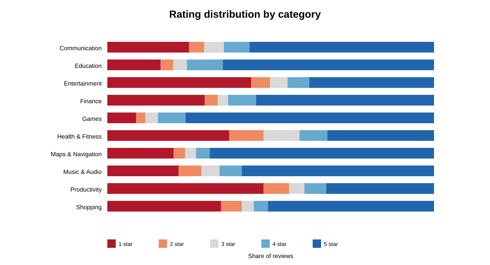
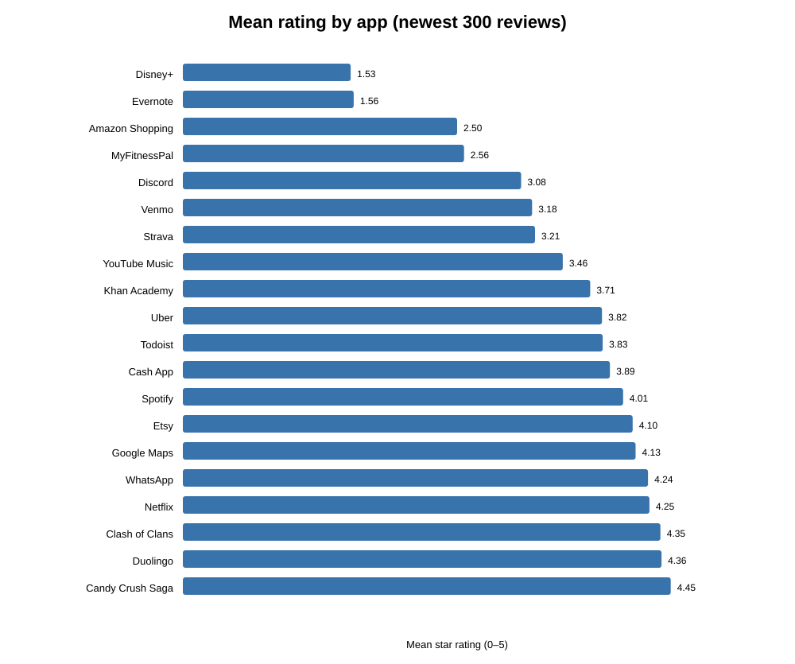
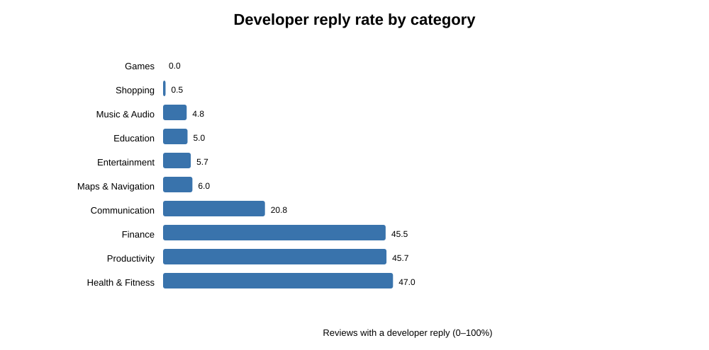

# Google Play Exploratory Data Analysis

Analysis date: 2026-09-26 (America/Chicago)

## Executive summary

The expanded collection produced 6,000 reviews from 20 apps in 10 categories,
with 300 newest-sorted reviews per app. All targets succeeded. The sample is
large and varied enough to support an initial database design, provided the
database preserves the sampling and ingestion context instead of treating the
reviews as a representative view of Google Play.

The core review fields are strong: review ID, text, star rating, helpful count,
and timestamp were present for all 6,000 records. Review version was available
for 85.7%. Developer replies are analytically useful but sparse and highly
app-dependent: 18.1% of reviews had a reply overall, ranging from 0% for several
apps to 94.0% for MyFitnessPal.

The newest-review samples differ substantially across apps. Mean ratings range
from 1.53 for Disney+ to 4.45 for Candy Crush Saga. The same 300-record count
covers less than one day for some high-volume apps but about 130 days for
Todoist. This makes record count, collection time, sort order, storefront,
language request, and each app's observed time window essential provenance.

## Scope and method

The collection used `google-play-scraper` 1.2.7, an unofficial open-source
package that relies on undocumented Google Play interfaces. It requested the
newest reviews with `lang="en"` and `country="us"`. These parameters describe
the request; they do not establish reviewer location or guarantee that every
returned review is in English.

The sample contains two apps from each of ten categories:

| Category | Apps | Reviews |
|---|---|---:|
| Communication | Discord, WhatsApp | 600 |
| Education | Duolingo, Khan Academy | 600 |
| Entertainment | Disney+, Netflix | 600 |
| Finance | Cash App, Venmo | 600 |
| Games | Candy Crush Saga, Clash of Clans | 600 |
| Health & Fitness | MyFitnessPal, Strava | 600 |
| Maps & Navigation | Google Maps, Uber | 600 |
| Music & Audio | Spotify, YouTube Music | 600 |
| Productivity | Evernote, Todoist | 600 |
| Shopping | Amazon Shopping, Etsy | 600 |
| **Total** | **20 apps** | **6,000** |

Reviewer names and profile images were not retained. Review and developer-reply
text remains in the ignored local JSONL file. The committed results contain
only aggregate metrics.

## Main review characteristics

| Metric | Result |
|---|---:|
| Mean star rating | 3.51 |
| Median star rating | 5.00 |
| 1-star reviews | 28.6% |
| Negative reviews (1–2 stars) | 34.3% |
| Positive reviews (4–5 stars) | 60.7% |
| Mean review length | 95.8 characters |
| Median review length | 39 characters |
| 90th-percentile review length | 290 characters |
| Reviews with one or more helpful votes | 24.2% |
| Reviews with a developer reply | 18.1% |

The rating distribution is polarized: the median is five stars even though
more than one quarter of records are one-star reviews. Review length is also
right-skewed; the mean is more than twice the median. Median values and full
distributions will therefore be more informative than averages alone.



## Metadata coverage and quality

| Field | Coverage | Interpretation |
|---|---:|---|
| Review ID | 100.0% | Suitable as the source identifier within an app |
| Review text | 100.0% | Present in this sample |
| Star rating | 100.0% | All values were valid integers from 1 to 5 |
| Helpful count | 100.0% | Present, including zero values |
| Review timestamp | 100.0% | No timestamp occurred after ingestion |
| Review/app version | 85.7% | Nullable field required |
| Developer reply presence flag | 100.0% | Reliable boolean in this sample |
| Developer reply text/timestamp | 18.1% | Present exactly when a reply was observed |
| Ingestion timestamp | 100.0% | Collector-supplied provenance field |

There were no duplicate `(package_name, review_id)` keys, invalid ratings, or
reply-field consistency errors. There were 878 repeated normalized text values
after the first occurrence (14.6% of records). These are not duplicate review
IDs and frequently reflect short generic phrases, so they should be retained
but flagged if later analyses require text-level deduplication.

`review_created_version` and `app_version` were identical in every record in
this collection. Storing both would add no observed information. A single
nullable review-version field is sufficient unless a later source establishes
that the fields have different meanings.

## Differences across categories and apps

| Category | Mean rating | Negative | Median length | Developer reply rate |
|---|---:|---:|---:|---:|
| Games | 4.40 | 11.7% | 16 | 0.0% |
| Education | 4.04 | 20.2% | 36.5 | 5.0% |
| Maps & Navigation | 3.97 | 23.8% | 16 | 6.0% |
| Music & Audio | 3.74 | 28.8% | 25 | 4.8% |
| Communication | 3.66 | 29.7% | 25 | 20.8% |
| Finance | 3.54 | 33.8% | 41.5 | 45.5% |
| Shopping | 3.30 | 41.2% | 65 | 0.5% |
| Entertainment | 2.89 | 49.8% | 51.5 | 5.7% |
| Health & Fitness | 2.89 | 47.8% | 77 | 47.0% |
| Productivity | 2.69 | 55.7% | 101.5 | 45.7% |

These category values are descriptive comparisons of two selected apps per
category, not estimates of category-wide performance. Within-category gaps can
be larger than the category differences. For example, Entertainment combines
Disney+ at 1.53 with Netflix at 4.25, and Productivity combines Evernote at
1.56 with Todoist at 3.83.



Developer response behavior also appears to be an app policy rather than a
uniform property of a category or source. MyFitnessPal replied to 94.0% of its
sample, Cash App to 90.3%, and Todoist to 89.7%, while many apps had no replies.
Missing reply text must mean “no reply observed,” not missing collection data,
when the reply-presence flag is false.



The same fixed count represents very different time coverage. The 300 newest
WhatsApp reviews cover about 0.1 day, while the 300 Todoist reviews cover about
129.5 days. Comparisons of raw counts over this sample would therefore be
misleading unless they account for the time window.

## Exploratory issue themes

Fixed keyword groups were used only as a transparent first pass. Across all
records, payment or subscription terms appeared most often (7.3%), followed by
login or account terms (6.3%) and update or version terms (5.7%). The highest
category rates were:

- Finance for login/account terms: 12.3%.
- Productivity for payment/subscription terms: 14.2%.
- Productivity for advertising terms: 15.3%.
- Health & Fitness for update/version terms: 13.8%.
- Finance for customer-support terms: 5.7%.

These values show where deeper qualitative coding may be productive. They do
not measure sentiment or prove that the named issue caused the rating.

## Implications for the next database-design stage

The EDA supports retaining separate app, collection-run, review, and developer-
reply concepts. In particular:

- Use `(source, package_name, review_id)` as the natural uniqueness boundary.
- Store collection settings and timestamps with each run, including locale,
  language request, sort order, target count, and requested record limit.
- Keep both `review_timestamp` and `ingested_at`; they answer different
  questions and allow collection lag to be measured.
- Make review version and developer-reply fields nullable.
- Preserve a boolean reply-presence field so “no reply” is distinct from an
  extraction failure.
- Keep app metadata as a time-stamped snapshot because ratings, install counts,
  version, and other store attributes change.
- Do not use an app's sampled review count as an activity measure. Store the
  observed oldest/newest timestamp or derive the window from each run.
- Retain raw text only in the access-controlled analytical layer; publish
  aggregate outputs in the repository.

## Reproduction and outputs

Run:

```bash
.venv/bin/python src/collectors/google_play_eda_collection.py --reviews-per-app 300
.venv/bin/python src/google_play_eda.py
```

The reproducible aggregate outputs are in `results/google-play-eda/`:

- `collection-summary.json`: configuration, app metadata snapshots, and
  target-level collection results.
- `analysis-summary.json`: overall metrics, data-quality checks, extremes, and
  limitations.
- `app-summary.csv` and `category-summary.csv`: comparison tables.
- `field-coverage.csv`, `rating-distribution.csv`, and `theme-summary.csv`:
  supporting aggregate tables.
- Three SVG charts used in this report.

## Limitations

- This is a bounded convenience sample of newest-sorted reviews, not a random
  or representative sample.
- Equal counts per app are useful for comparison but do not reflect popularity
  or total review volume.
- The language/storefront parameters do not prove reviewer language or country.
- App and category findings may reflect short-lived product events during
  different observed time windows.
- Keyword themes are incomplete and can contain false positives or miss
  synonymous language.
- The unofficial collection dependency can break without notice and remains
  unsuitable as an approved production integration without separate review.
